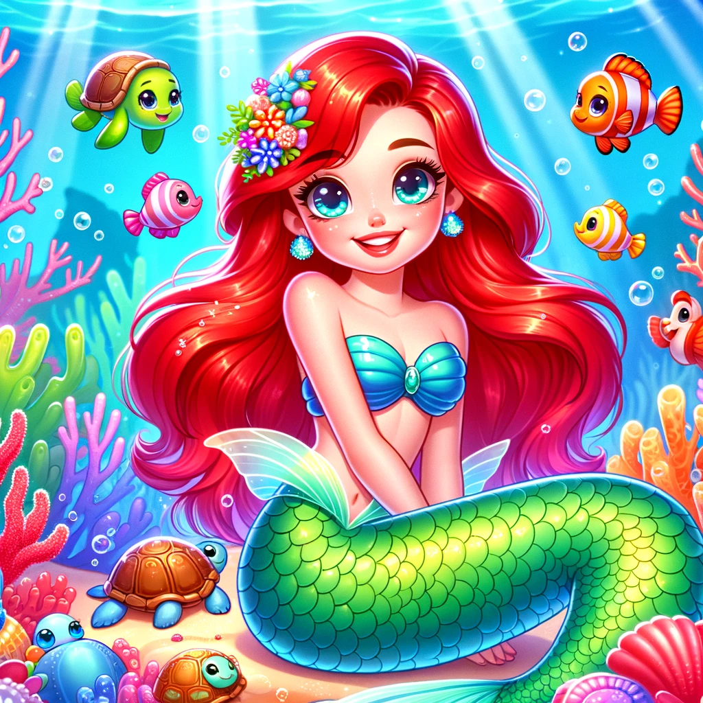

## Prompt by riza mohammad

Create a vibrant and colorful cartoon image of a mermaid princess named Ariel. She's youthful and cheerful, with sparkling eyes and a bright smile. Her long, radiant red hair is styled with sea flowers, and her tail is a dazzling mix of greens and blues, embellished with pearls and sea jewels. She's sitting on a coral throne under the sea, surrounded by friendly sea creatures like fishes, turtles, and seahorses, all in a whimsical, cartoon style. The underwater scene is alive with color, from the coral reefs to the playful rays of light filtering through the water, highlighting the magical and fun atmosphere of Ariel's underwater kingdom.

## DALL·E 2024-03-17 09.57.09

