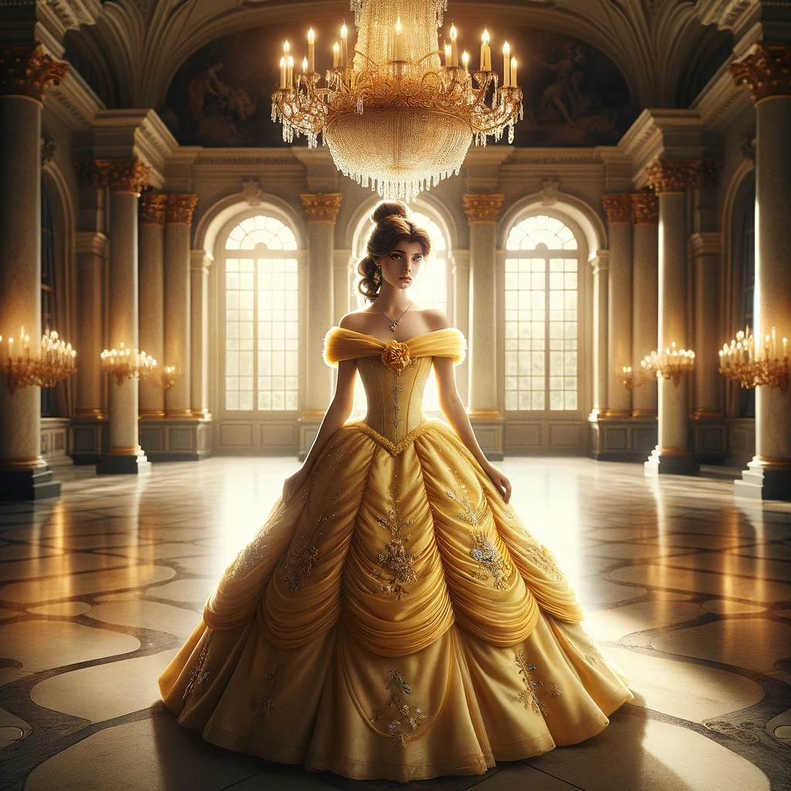

## Prompt by riza mohammad

A princess named Belle, wearing a magnificent yellow gown, stands in the center of a grand ballroom. Her dress is detailed with fine embroidery and sparkles under the chandelier's light. Belle's hair is styled in an elegant updo, adorned with a few small, delicate flowers. The ballroom around her is opulent, with marble floors, tall columns, and large, arched windows that let in the moonlight. She looks poised and graceful, embodying the classic beauty and charm of a fairytale princess. This image captures the enchanting moment of Belle in her element, surrounded by the splendor of the ballroom

## DALL·E 2024-03-17 10.11.38

